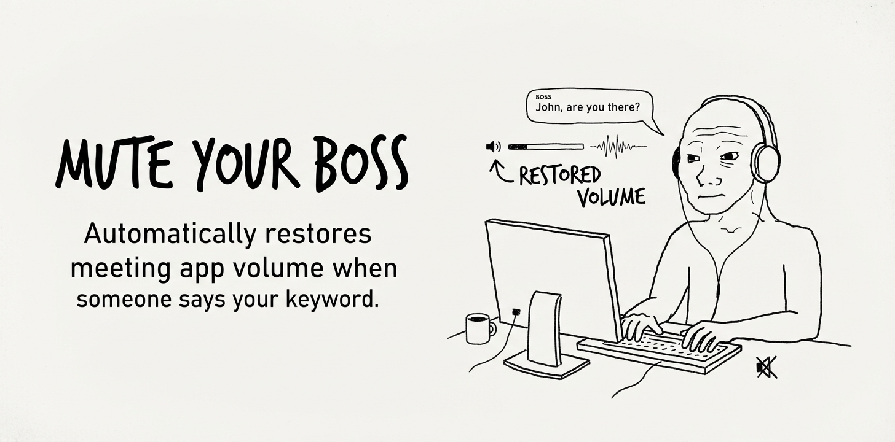

# Mute Your Boss



Mute Your Boss automatically restores the volume of a meeting app when someone in the meeting says a configured keyword.

## What It Is

Mute Your Boss helps you tune out a long-winded meeting without worrying you'll miss your cue.

Pick a few keywords — your name, "are you there?", or whatever means someone needs you — and turn the meeting app volume down. When someone in the meeting says one of those keywords, the tool temporarily restores the volume so you know you're being addressed. Once the moment passes, you can mute again and get back to work.

## Supported Apps

The goal is to support common meeting apps on Windows, macOS, and Linux:

- Tencent Meeting
- Feishu / Lark
- Zoom
- Microsoft Teams
- Other apps that expose a separate audio session

Platform-specific adapters are still being implemented. The current release focuses on the core pipeline and Windows support.

## How to Use

### 1. Download a Keyword Model

Download the Chinese-English keyword spotting model and extract it under `models/`:

```bash
mkdir -p models
curl -L -o models/kws.tar.bz2 \
  https://github.com/k2-fsa/sherpa-onnx/releases/download/kws-models/sherpa-onnx-kws-zipformer-zh-en-3M-2025-12-20.tar.bz2
tar -xjf models/kws.tar.bz2 -C models
rm models/kws.tar.bz2
```

### 2. Configure Keywords

Create a `policies.yaml` file:

```yaml
policies:
  - name: roll-call
    match:
      keywords:
        - "YOUR_NAME=y ou r n ey m"   # English: ARPAbet phonemes
        - "我要发言=w ǒ y ào f ā yán"  # Chinese: pinyin with tones
      threshold: 0.6
    action:
      volume: 100
      duration_seconds: 30
      then: mute
```

> **Note:** Keywords must be written as phonemes (English) or pinyin with tones (Chinese) so the model can recognize them. A pinyin auto-conversion helper is planned.
>
> **Note on control flow:** The app restores volume when a keyword is detected and keeps it up for the configured duration. You remain in control: changing the volume yourself pauses automatic handling, and the panic shortcut immediately restores normal volume.

### 3. Start the Server

```bash
make run-server
```

### 4. Open the GUI and Start a Session

Select the meeting process, load your `policies.yaml`, and click start. The app listens only to that process and adjusts its volume independently of your system volume.

## Important Notes

- **Local only.** The server listens on `127.0.0.1` and uses a local authentication token. No audio leaves your machine.
- **Manual override.** If you change the target app's volume yourself while a session is active, automatic control pauses so the tool does not fight you.
- **Panic shortcut.** Press `Ctrl+Alt+M` (configurable) at any time to immediately restore volume and pause policies.
- **Model not included.** The keyword model is downloaded separately and ignored by Git.
- **Work in progress.** Platform adapters and the Tauri GUI are still under active development.

## License

MIT
